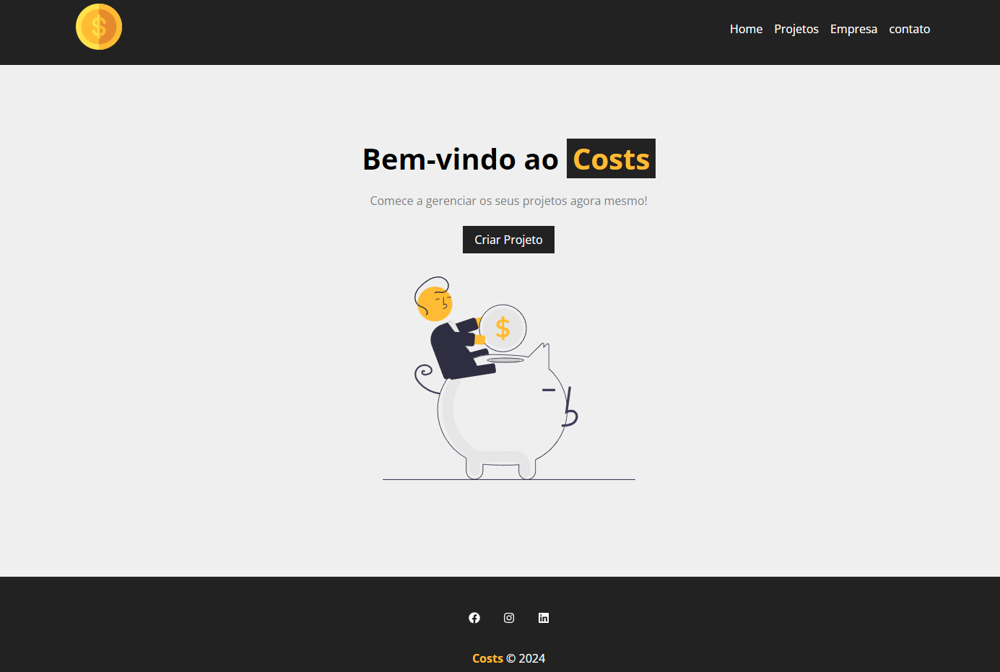
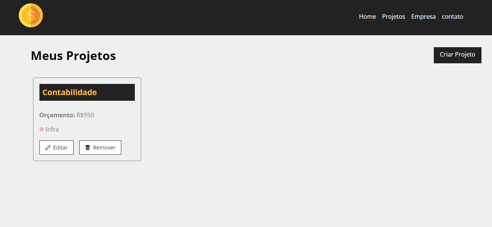
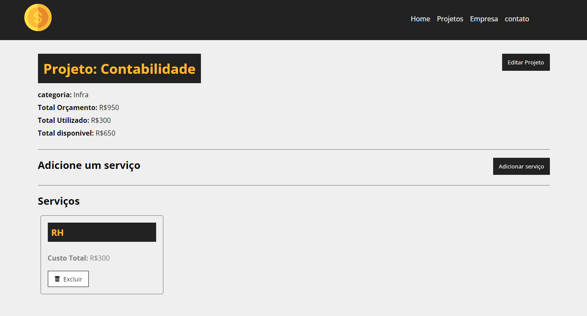

# Costs

Este é um aplicativo de gerenciamento de projetos construído com React, desenvolvido durante um curso de React no Youtube.

## demostração

## Tecnologias Usadas

- React
- JavaScript
- CSS
